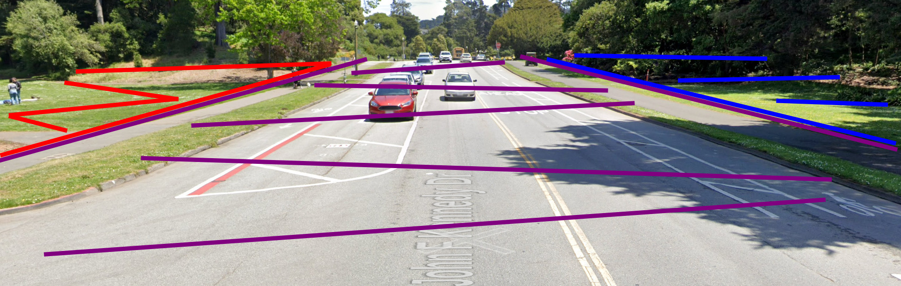
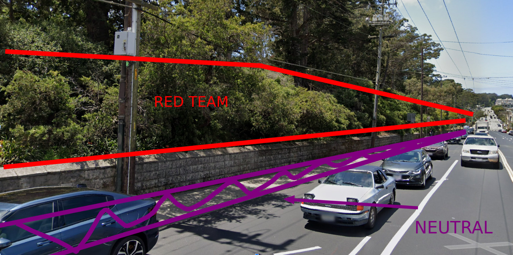

  

    
  

The map, again.

Key:
- Blue: Blue team territory
- Red: Read team territory
- Purple: Neutral (no mans land), you cannot be tagged
- Black: do not go inside buildings/marked areas

## Exceeding Map Boundaries

Going beyond red or blue is forbidden. If a red or blue territory is marked on a trail/path, the trail/path is considered in bounds. If a foot lands beyond territory lines, you are considered out of bounds, and instantly tagged.

## Neutral Territory Clarifications

You taggable if any part of you is touching red/blue team territory. In other words, even if you have one foot inside neutral, you are still taggable by the relevant team. You are only safe if all ground contact points are inside neutral territory.

### Neutral Boundaries

  

    
  

<!-- 

A photo from a CTF game in Feb!
 -->
At JFK drive, the neutral territory extends to the sidewalks, and begins at the grass beyond the sidewalks. We do this so that you are not running across JFK drive.

### Back Edges

  

    
  

<!-- 

 -->

Neutral territory at the back edges of maps are on the sidewalk. It is not illegal to flip the wall pictured, but that's sweaty asf bro.

Back edges are neutral so that teams have to defend from the rear as well.