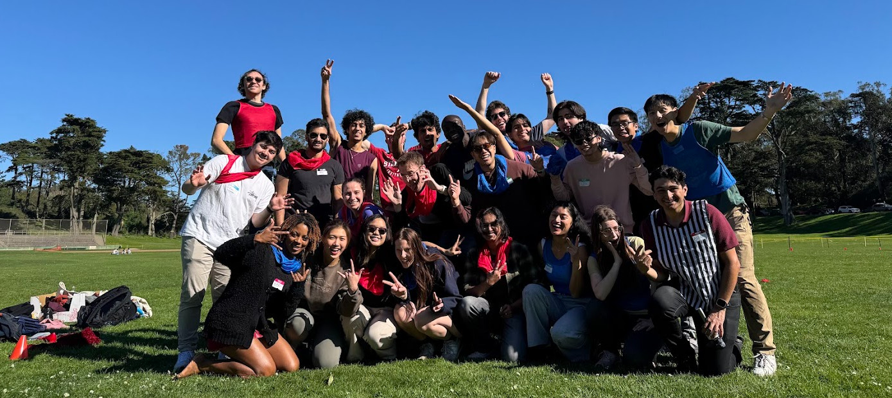
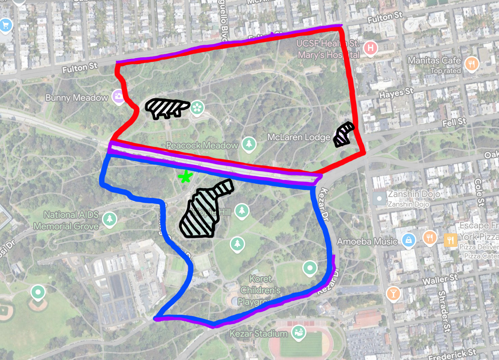
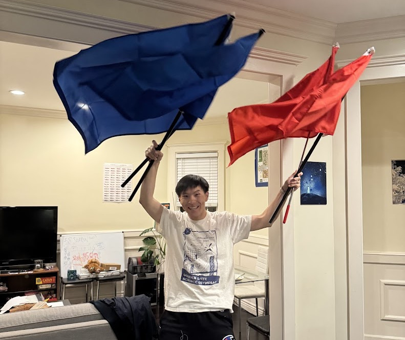

  

    
  

A photo from a CTF game in Feb!

# Why
Why are we playing capture the flag in such a large area??

Typically, capture the flag is a game of running, but we want to have silly moments with the homies. Plus, we're out of shape.

By making the map larger, it addes opportunities to sneak past enemies, blend in with pedestrians, sneak behind bushes, and make friends in a behind-enemy-lines clandestine operation. Of course though, there will still be plenty of running.

# Where and When

04-27 Sunday 1:00 PM @ Golden Gate Park. [Meet across conservatory of flowers](https://maps.app.goo.gl/e5Xjoot5T32K7njY8).

## Schedule

- 1:00 - 1:30 ---- Snacks, Nametags, Team Formation, Rules
- 1:30 - 2:00 ---- Strategizing, Circle Placement
- 2:00 - 3:00 ---- Game 1
- 3:00 - 3:30 ---- Break, Flag Reset
- 3:30 - 4:30 ---- Game 2

Please show up on time for rules/team formation! If you miss too much, we'll ask to to come back at 3:00 instead.

## What to Bring / Wear

Attire:
- Long hiking pants / leggings
- Long socks
- Extra pair in case it gets wet
- Sneakers
- Light jacket in case of rain

Other
- Water bottle
- Insect repellant if you have it - we will share

_We will be using WhatsApp for exact timing and intra-team communication. Please install it ahead of time._

If you're coming from something else and have a bag, you can leave it by your team's flag circle and it will implicitly watched over.

# Map

  

    
  

Key:
- Blue: Blue team territory
- Red: Read team territory
- Purple: Neutral (no mans land), you cannot be tagged
- Black: do not go inside buildings/marked areas
- Green Star: meeting spot

See also [additional border rules](border).

_Note: the map has been modified since the last text blast to exclude Kezar drive so we're not being unsafe._

# Rules

## Flags

  

    
  

We made 4 flags for the game!

Each divided team will collectively decide where they want to put their flags within the boundary. However refs will play a part in finding a fair location.

Flags are placed inside a flag circle. The flag circle must encompass a large area, and easily accessible from most directions. Flag circles must be placed on top of mowed grass. The area inside the flag circle is a safe zone (you can’t be tagged). Each team will have two flags in the center of their flag circle[^1].

## Starting

Before the beginning of the game, all team members must start within the flag circle of their team. A textblast will mark the official and start and end of the game.

## Tagging
If a player is tagged, they must go to jail. The tagger must share the location of the flag circle via decent instructions so the prisoner may make their way there on their own[^5]. You walk to jail with your hands on your head to mark that you are out of the game.

## Standard Jail Break
A teammate (a jail breaker) may free jailed players by running into the enemy jail circle. One jail breaker entering the circle will free all jailed teammates.

Everyone besides jail breaker gets a free walk back. Freed tagged players must return to their team's side before doing anything else.

Each team will decide where they want to put their jail zone within the boundary. The jail zone must have the same clearance rules as the flag circle. It must also be placed within eyeshot of the flag circle.

A jail breaker is safe within the jail circle, but does not get a free walk back, and is unsafe after leaving the flag circle.[^3]

## Alternative Jail Break
Hate standing around waiting to be freed? You can jail break yourself via the following methods:
- Loudly sing covers of three different song released before 2015 with atleast 3 other prisoners. Each song must be >3 minutes. Jail Wardens may ask you to sing louder if not loud enough.
- Do 100 burpees (pushup + jumping jack)[^7]. You must say the burpee number you are on after **each** burpee.
- Jail warden negotaiated choice (defender's choice)

Alternative jail break only frees the people who actually did the activity, it does not free everyone.

_The goal here is to create an upper bound of ~10 minutes in jail_

## Out of bounds
Going out of bounds intentionally or unintentionally (being chased out) results in being automatically tagged + jailed.

To not interfere with people trying to have a nice day in the park, entering bystanders play areas for spikeball/volleyball/soccer, running into bystanders, or stepping on picnic stuff counts as out of bounds, and counts as being tagged as above.

See also [additional border rules](border).

See also [additional rules for brush/paths](paths).

## Vibes
This is about having fun, while winning is lit, all players reserve the right to say "it's not a big deal, let's do the thing that makes the vibes nicer". Keep your vibe-dar on and listen if something you're doing is not making the vibe lit.

## Team Formation
"Package deals" (groups of friends) are allowed of up to 4. We will try* to keep these groups together when making teams. Being on time will help trumendously!

## Arbitration
If you have a disagreement about whether or not you are tagged or whether or not you are out of bounds. Yell "Stop!" talk out what you think is happening or has happened. Come to a reasonable agreement. Ties are settled via a game of rock-paper-scissors.
- Regarding map boundaries/off-trail always err on the side of safety/less-sweaty.

After arbitration, if the chasee is no longer in the wrong, let chasee have a **two second head start**, then resume the chase.

## Winning
The game does not end when all flags are captured. Instead the victor is determined by who has the most flags at the end of the game timer. This lets the losing team a chance to mount a counter-attack.

A flag is only defined as captured if it has made it to within the opposing team's flag circle[^6].

## Additonal
If someone is fleeing a flag circle with a flag in hand, and then becomes tagged, the flag _must_ be returned by the tagger within 5 minutes. If not, the flag counts as scored[^4].

You can only hold one flag at a time.

# Safety
If you get hurt, and need help, yell "Help!". And all nearby players who are mid game and hear should stop playing (atleast temporarily) and assist. After, resume play via arbitration rules.

If you are chasing/being chased, and notice your opponent trip, do not wait for them to ask for help. Stop/turn around, check if they are ok first. After, resume play via arbitration rules.

Shihao and Mariel can be reached via the below, and we can coordinate larger help.
- Shihao - 571 405 893 seven
- Mariel - 415 416 062 five

First aid will be available.

# Other

If you have suggestions for rules/silly-ideas that you want to see this event please shoot us an email at shihaocao@gmail.com, or marielr@isaksonfamily.net, or dm us on twitter at [@shihao_cao](https://x.com/shihao_cao).

As organizers, we reserve the right to make changes to the rules as needed day of to balance the game.

[^1]: We have multiple flags in play so that while one flag is being returned/stolen, a team is not blocked significantly from being able to score a different flag. Circles will be marked via string and cones.
[^2]: Flag circles and Jail circles exist so create clear well defined boundaries with which you can't puppy guard. Puppy guarding means being really close to the objective making it impossible to enter.
[^3]: We make a jail breaker still vulnerable so they have the option of doing hail mary play of jail break -> flag capture. If they also got a free walk back, they would not be able to flag capture.
[^4]: We enforce returning because a dropped flag has no well-defined flag circle, so no puppy-guarding is hard to enforce. We auto-score flags not returned sufficiently soon to make sure you can't just block scoring by returning flags slowly.
[^5]: We don't think it's fun to make a tagger to walk a prisoner all the way to jail. So this is the compromise.
[^6]: Once a flag has been brought to atleast the opposting team's territory they have 5 minutes to bring it to within their flag circle. This is to prevent a flag from staying in a prolonged state where a team cannot recapture a flag by virtue of being in enemy territory but not in a flag circle.
[^7]: Burpees can be hard. A member may do extra burpees to make it easier for a teammate.