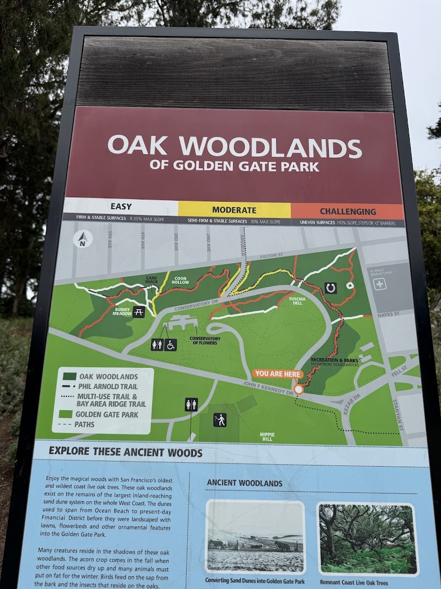

The Red Team side has a lot of interesting paths. These rules also apply to the relevant areas on blue team side.

North and East of Conservatory Drive is the Oak Woodlands. These areas are under conservation from the SF Parks and Rec. We don't want to trample areas under conservation, and it's less fun to chase someone through a bush.

  

    
  

This is a nice area. Let's be nice people.

Use these broad rules when in play:

- Stay away from areas of mulch marked with flags. Things have been planted there.
- Stay off sloped areas of greater than 45 degrees. Would not be fun to slip on that.
- If a path does not have any dirt/sand visible, it is probably too small of a trail.
- If you realize you're pretty off trail, it's fine, but return when possible.
  - Defenders have the option of going off trail to tag you too, but you should not go "further off trail" to escape. Use best judgement.

The rest of this document highlights examples of trails that are allowed or not allowed. 

---

<!-- 
 -->

## No Go Regions

Near the horseshoe courts in red team.

--- 

This is at the eastern border of the red team.

---

## Ok Paths Among No Go Regions

This is near the northern border of red team.

## Blue Team Clarification

This sidewalk next to the courts is ok. Please be careful around corners.

